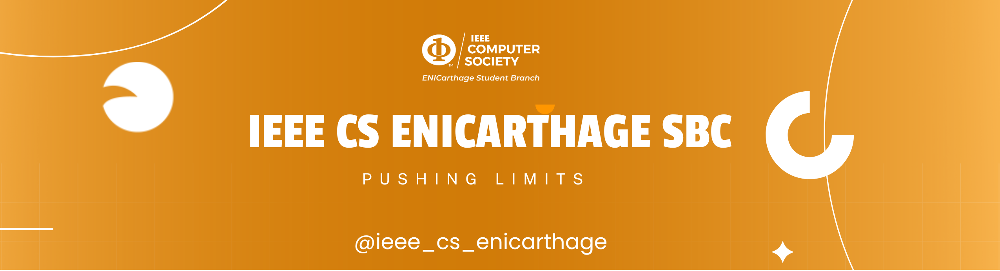

<!-- ========================================================= -->
<!--                IEEE CS ENICarthage SBC README            -->
<!--          Modern • Professional • Multi-Year Template     -->
<!-- ========================================================= -->

<p align="center">
  
</p>

<p align="center">
  <a href="https://www.map.org.uk">
    
  </a>
</p>

<p align="center">
  
</p>

---

# 🧭 About IEEE CS ENICarthage SBC

The **IEEE Computer Society ENICarthage Student Branch Chapter** is a student-driven community focused on:

- 💻 Software Engineering  
- 🤖 Artificial Intelligence  
- 🔐 Cybersecurity  
- ☁️ Cloud & DevOps  
- 📱 Mobile & Web Development  
- 🧪 Research & Innovation  

We empower students with:
- Technical workshops  
- Hackathons  
- Training programs  
- Community events  
- Industry collaborations  
- Open-source initiatives  

---

# 👥 **Boards Through the Years**

> This section is **permanent**. Each new board adds a new entry.

## 🎓 **Board 2024–2025 (Current)**

| Role | Member |
|------|--------|
| **Chairperson** | Talel Mejri | 
| **Vice Chair** | Aya chokri | 
| **General Secretary** | Chahed Requez | 
| **Webmaster** | Maha Dridi | 
| **Treasurer** | Aya Abbassi |

### ⭐ Achievements 2024–2025
- Organized 10+ workshops and tech talks  
- Hosted the National AI Hackathon  
- Launched Club Portfolio Website  
- Contributed to multiple open-source projects  

---


# 📊 GitHub Statistics

<p align="center">
  
</p>

<p align="center">
  
</p>

<p align="center">
  
  
</p>

<p align="center">
  
</p>

<p align="center">
  
</p>

---

# 🌍 Location: Tunisia

```geojson
{
  "type": "FeatureCollection",
  "features": [
    {
      "type": "Feature",
      "properties": { "name": "Annexe ENICarthage" },
      "geometry": {
        "type": "Polygon",
        "coordinates": [
          [
            [10.2032768, 36.8574056],
            [10.2058517, 36.8574013]
          ]
        ]
      }
    }
  ]
}

````

### ✍️ Random Dev Quote
<p align="center">  </p>

###  📬 Contact & Social Media
<p align="center"> <a href="mailto:yourclub@email.com"></a> <a href="https://www.linkedin.com/company"></a> <a href="#"></a> <a href="#"></a> <a href="#"></a> </p> <p align="center"><em>Always innovating, always improving — year after year.</em></p> 
